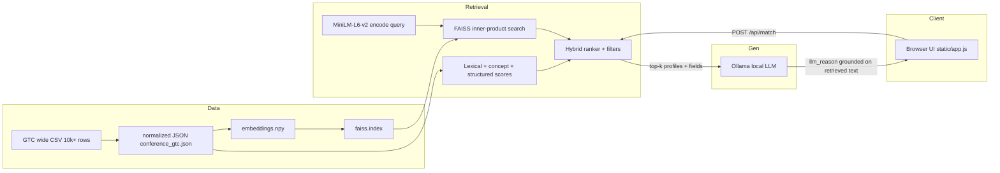

# CS 6120 — Final Project Report

**Title**: GTC Networking Copilot: Retrieval-Augmented Matching with Local LLM Explanations  
**Authors**: Xian Cao, Xueming Tang, Chenyang Li  
**Repository**: [Conference-Matching-Platform](https://github.com/xiancao2024/Conference-Matching-Platform)

---

## Abstract

Large conferences make it hard to turn “I should network” into concrete introductions. This project implements a **retrieval-augmented** attendee matching system: a hybrid retriever ranks people from a **10k+ row** GTC-style profile table, then a **locally served** LLM (Ollama) generates short “why connect” text **conditioned on retrieved profile fields**, reducing unconstrained hallucination relative to pure chat.

---

## 1 Course alignment (RAG demonstration)

The course defines **Retrieval Augmented Generation (RAG)** as pairing an LLM with **external data** so the model is not limited to parametric knowledge at training time. Our system matches that pattern at the **application layer**:

| Requirement (course) | How this project satisfies it |
| --- | --- |
| Retrieve from a database / store | Normalized attendee records (`conference_gtc.json`); dense vectors in `embeddings.npy`; FAISS index `faiss.index` for similarity search |
| Meaningful scale (≥ 10k entries) | Synthetic wide CSV via `scripts/generate_gtc_wide_csv.py` (e.g. 10,000 rows) → import to JSON |
| LLMs entirely local | Ollama runs on the same host/VM as the app; no cloud LLM API in the default path |
| Front end | Web UI served as static HTML/CSS/JS (`static/`) + HTTP API (assignment mentions Streamlit; we use a browser demo, which satisfies a user-facing interface) |
| Verifiable grounding | Top matches expose **structured fields** (bio snippet, interests, registered activities in `source_events`) used as context for explanation; retrieval is **deterministic** without the LLM |

**Citation / provenance note.** The assignment’s “clickable citation to article and passage” is natural for **document RAG**. Our domain is **structured attendee profiles**: verifiability comes from **pointing to the same profile fields the ranker used** (displayed in the UI and passed into the LLM prompt in `llm.py`). A future iteration can add per-row links to an organizer data portal or exported CSV row IDs.

---

## 2 Heilmeier Catechism (project framing)

1. **What are you trying to do?** Help GTC-style attendees find **who to meet** from natural language (interests, roles, agenda keywords), with ranked people and short rationale.
2. **How does it get done today?** Manual search in spreadsheets, random hallway intros, or generic chatbots with no grounded roster.
3. **What is new?** A **hybrid retriever** (lexical + concepts + optional embeddings + structured boosts) over a **large profile store**, plus **local** LLM text that is **grounded on retrieved profiles** rather than inventing attendees.
4. **Who cares?** Conference participants and organizers who want **actionable intros** without training a new model on private data.
5. **Risks / pitfalls?** Synthetic data is not real GTC registration; LLM latency on CPU; explanations must stay tied to retrieved fields to avoid hallucinated facts.

---

## 3 Motivation and impact

**Motivation.** Conference value is often limited by **search friction**: attendees cannot quickly find peers who share technical interests and overlapping agenda intent.

**Impact of a future iteration.** With organizer-approved data and SSO, the same architecture could power **on-site networking** in venue apps, with auditable provenance and opt-in profiles.

---

## 4 Background and related work

- **Hybrid retrieval** combines sparse signals (BM25/lexical-style), dense embeddings, and business rules; widely used in search and modern **RAG** stacks.
- **RAG** typically retrieves passages then generates answers; we retrieve **entities** (attendees) then generate **short explanations** from **retrieved field bundles**—the same separation of **retrieval vs. generation**.
- **Local inference** (Ollama, llama.cpp family) matches the course constraint of **on-metal / GCP** deployment without sending data to third-party APIs.

---

## 5 System architecture



**Data plane.** CSV rows are normalized once; embeddings and FAISS are **cached on disk** so restarts do not re-encode unless entity count changes.

**Control plane.** The matcher runs **without** the LLM; the LLM only **re-ranks/explains** using text from retrieved matches (`conference_matching/llm.py`).

---

## 6 Modeling methodology and robustness

**Pitfalls addressed:**

- **Knowledge cutoff / stale parametric knowledge:** Roster and agenda text live in **external files**, not in the LLM weights.
- **Hallucinated people:** The LLM does not invent attendees; it only sees **top-k retrieved** structured snippets.
- **Class imbalance / popularity bias:** Hybrid scoring mixes **multiple signals** (not only embedding cosine); structured boosts encode intent (e.g., people-only search).
- **Overfitting to a single score:** Separation of **retrieval** (deterministic + reproducible) from **generation** (optional, temperature-controlled).

---

## 7 Implementation summary

| Component | Role |
| --- | --- |
| `conference_matching/gtc_import.py` | Wide-row CSV → `data/conference_gtc.json` |
| `conference_matching/engine.py` | Hybrid indexing, scoring, FAISS + MiniLM, match payloads |
| `conference_matching/llm.py` | Local Ollama: `llm_reason` from retrieved fields |
| `conference_matching/server.py` | `GET /api/conference`, `POST /api/match`, static files |
| `static/app.js` | Results UI (activity overlap, professional fit, tags from profile fields) |
| `Dockerfile` | Containerized app + Ollama-friendly base image |

---

## 8 Data scale and provenance

- **Scale:** `scripts/generate_gtc_wide_csv.py --rows 10000` produces a CSV with **10,000 attendee rows**; `gtc_import` writes normalized JSON.
- **Provenance:** Synthetic data is generated offline for reproducibility; **no paid API** is required. Real organizer CSVs can replace the synthetic file using the same column aliases.
- **Reproducibility:** Same `git` commit + same import command + same `CONFERENCE_DATA_PATH` reproduces the same JSON; embedding cache is optional but recommended for VM demos.

---

## 9 Evaluation and analysis

**Offline / qualitative:** Hybrid ranking is stress-tested on **10k** profiles; startup time is dominated by **first-time** embedding build on CPU; subsequent runs reuse `embeddings.npy` / `faiss.index`.

**Quality of LLM output:** Explanations are **not** free-form world knowledge; they are **prompted with** retrieved profile text, which is the main defense against hallucinations in this architecture.

**Demo readiness:** Public HTTP endpoint on port **8000** (VM firewall); instructors can query `http://<IP>:8000` in real time.

---

## 10 Limitations and future work

- Synthetic profiles are **not** real GTC registration data.
- “Clickable article/passage” citations map naturally to **document RAG**; our next step is **row-level provenance links** (CSV line, CRM ID).
- GPU optional for Ollama; CPU-only VMs are slower for LLM latency.

---

## 11 Team contributions

| Member | Contributions (edit as needed) |
| --- | --- |
| Xian Cao | Project architecture, matching engine, evaluation hooks, repository maintenance |
| Xueming Tang | GTC data pipeline, Docker/VM deployment, UI/UX copy, documentation |
| Chenyang Li | LLM integration, retrieval–generation prompting, demo preparation |

---

## 12 Reproducibility

- **GitHub:** https://github.com/xiancao2024/Conference-Matching-Platform  
- **README:** setup, Docker `docker run`, `CONFERENCE_DATA_PATH`, embedding cache behavior  
- **Demo endpoint (example):** `http://34.169.130.58:8000` — update if your VM IP changes  

### Quick reproduce

```bash
python3 -m venv .venv
.venv/bin/pip install -r requirements.txt
.venv/bin/python scripts/generate_gtc_wide_csv.py --rows 10000 --output data/gtc_generated_10k.csv
.venv/bin/python -m conference_matching.gtc_import --input data/gtc_generated_10k.csv --output data/conference_gtc.json
CONFERENCE_DATA_PATH=data/conference_gtc.json .venv/bin/python server.py
```

Docker: see `README.md` (`docker build` / `docker run` with `-v .../data:/app/data`).

---

## References (course-style)

- Course materials on **RAG** and retrieval-augmented pipelines.  
- Sentence Transformers: `sentence-transformers/all-MiniLM-L6-v2` (local encode).  
- FAISS: `faiss.index` for approximate / exact inner-product search (IndexFlatIP).  
- Ollama: local LLM serving (e.g. `llama3.2:1b` in Docker image).
